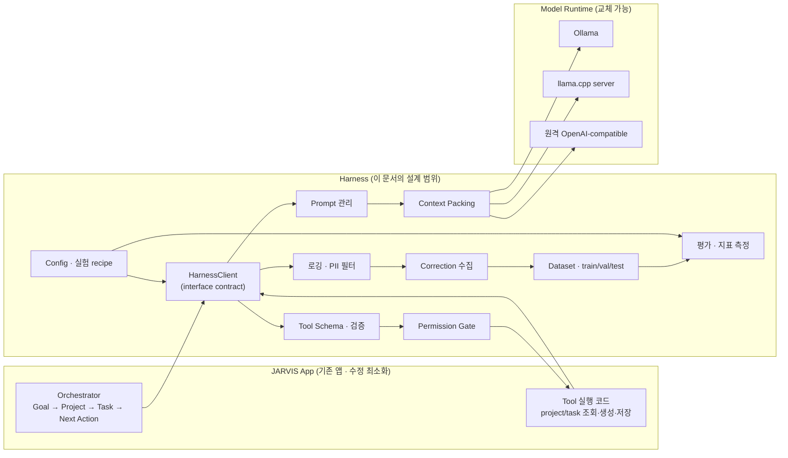
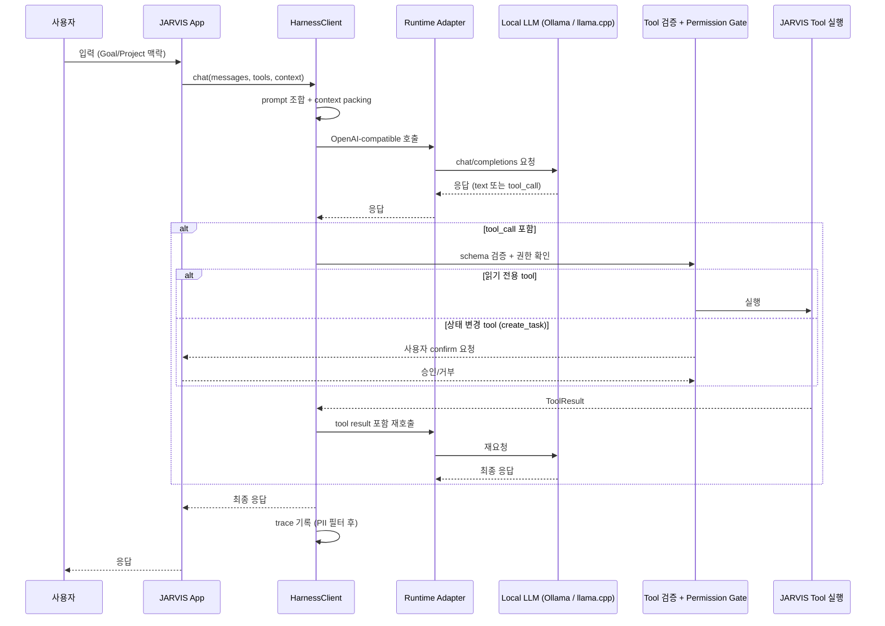

# JARVIS Local LLM — Harness Engineering Architecture

- **상태**: 설계 v4.7 — Slice 0(로컬 왕복)·Slice 1(tool schema+검증+gate+`get_project_context`)·Slice 2(모델 tool-call 루프)·Slice 3(자동 gate)·Slice 4(첫 상태 변경 tool `create_task`: confirm gate + 승인 후 정확한 call 1회 실행) 구현·검증 완료. **실 앱 통합: 부분 완료** — 실 JARVIS 앱의 텍스트 경로가 opt-in(`HARNESS_HOME`)으로 HarnessClient를 거친다(부록 D·§14 Slice 4)
- **작성일**: 2026-09-04
- **갱신**: 2026-09-04 — v4.7: 대화형 데모 `scripts/create_task_demo.py` + 실 앱 수직 슬라이스(`tools/harness_bridge.py`·`run_text_turn` 훅, 폴백 유지)
- **표기 규칙**: `[사실]` 확인된 사실 · `[제안]` 설계 제안 · `[미결정]` 아직 결정하지 않은 사항
- **이 문서의 범위**: Harness Engineering 설계만. 이번 단계에서는 runtime 구현·패키지 설치·모델 다운로드·학습을 수행하지 않는다.
- **문서 상태 주의**: 이 파일은 2026-09-04에 작성된 Harness 설계·구현 이력 스냅샷이다. 현재 JARVIS V4 제품 상호작용의 binding contract는 저장소 루트의 `JARVIS_V4_PRODUCT_DIRECTION.md`이며, 이 문서의 과거 UI·로드맵·다음 slice 표기는 현재 제품 방향이나 자동 진행 지시가 아니다.

---

## 1. 목적과 비목적

### 1.1 프로젝트 목적

JARVIS는 다음 흐름을 연결하는 개인 AI Command Center다.

```
Goal → Project → Task → Next Action → Execution
```

핵심 가치:

- **Continuity** — 대화·문맥이 끊기지 않는다.
- **Context Recovery** — 다시 시작해도 이전 맥락을 복원할 수 있다.
- **실행 가능한 Next Action** — 대화가 아닌 다음 행동으로 이어진다.
- **도구·문맥 관리 부담 감소** — 사용자가 직접 관리해야 할 것이 줄어든다.

### 1.2 Harness의 역할

Harness는 **LLM 자체가 아니라, LLM을 JARVIS에서 안정적으로 실험·비교·교체할 수 있게 만드는 주변 시스템**이다.
즉, 특정 모델·runtime·프롬프트·도구에 대한 "껍데기(harness)"를 만들어, 어떤 구성이 JARVIS에 적합한지
작은 비용으로 검증하고, 문제가 있으면 안전하게 되돌릴 수 있게 한다.

### 1.3 비목적 (Harness가 담당하지 않는 것)

| 항목 | 설명 |
|---|---|
| JARVIS UI 설계 | 화면·CLI 인터페이스는 기존 앱의 책임 |
| JARVIS의 실제 Task state 관리 | Goal/Project/Task/Next Action 저장·상태 전이는 기존 앱의 책임 |
| persistent product behavior | 제품의 장기 행동 규칙은 기존 앱의 책임 |
| 실제 tool execution 내부 로직 | `create_task`의 실제 저장 로직 등은 기존 앱의 책임 |
| 지금 단계에서의 LoRA 학습 | 데이터·평가 기반 구축이 먼저이며, 학습은 후속 단계 |
| 대규모 모델 다운로드 | Harness 설계 자체에는 다운로드가 포함되지 않음 (실행 단계의 환경 작업) |
| 기존 JARVIS 앱의 기능 수정 | Harness는 앱에 "연결"되며 앱의 기능을 바꾸지 않는다 |

---

## 2. Harness 책임 범위

### 2.1 포함 (Harness가 하는 일)

- 로컬 모델 및 runtime을 교체할 수 있는 **adapter**
- **OpenAI-compatible API 경계** (runtime과 Harness 사이의 표준 접점)
- **prompt와 system instruction 관리** (템플릿·버전 관리)
- **JARVIS context 입력 형식과 context packing**
- **Tool schema 정의와 tool call 검증**
- LLM의 tool 선택과 실제 실행 코드 사이의 **명확한 경계** (실행은 JARVIS, 판단은 LLM)
- 요청·응답·tool call·tool result **기록 (trace)**
- **개인정보·민감정보 제거 (PII 필터)**
- **실패 사례와 사용자 correction 수집**
- 학습용 **JSONL 생성** 및 **train / validation / held-out test 분리**
- 기본 모델과 LoRA 모델의 **동일 조건 평가**
- **latency·VRAM·tool accuracy·hallucination 측정**
- 설정과 실험 결과의 **재현성**
- **smoke test와 작은 end-to-end test**
- 모델 또는 LoRA를 안전하게 되돌리는 **rollback 구조**

### 2.2 제외 (1.3과 2.1의 여집합)

- 위 1.3 표의 모든 항목
- 실제 tool의 비즈니스 로직 (조회·생성·저장)
- Harness 내부에 특정 모델·runtime을 강제로 결합하는 일 (교체 가능해야 함)

---

## 3. 전체 구성요소



주요 구성요소 11개:

| # | 구성요소 | 역할 요약 |
|---|---|---|
| 1 | `HarnessClient` | JARVIS가 접촉하는 유일한 접점. interface contract 제공 |
| 2 | `Runtime Adapter` | Ollama / llama.cpp server / 원격 API를 같은 방식으로 호출 |
| 3 | `Prompt 관리` | system instruction·프롬프트 템플릿의 버전 관리 |
| 4 | `Context Packing` | JARVIS의 Goal/Project/Task/Next Action 문맥을 LLM 입력으로 변환 |
| 5 | `Tool Schema` | tool 목록·JSON schema 정의 및 생성 |
| 6 | `Tool 검증` | LLM이 만든 tool call의 schema·필수 필드 검증 |
| 7 | `Permission Gate` | 읽기 tool은 실행, 상태 변경 tool(`create_task`)은 사용자 확인 |
| 8 | `Trace` | 요청·응답·tool call·tool result 기록 + PII 필터 |
| 9 | `Correction` | 사용자 보정·실패 사례 수집 |
| 10 | `Dataset` | JSONL 생성, train/val/held-out 분리 |
| 11 | `Evaluator` | 동일 조건 평가 (base vs LoRA), latency·VRAM·tool accuracy·hallucination |

---

## 4. 구성요소별 책임

### 4.1 `HarnessClient`
- **책임**: JARVIS의 모든 LLM 호출을 대신 처리. `chat()` 1회 호출로 내부적으로 prompt packing → adapter 호출 → tool call 반복 처리 → 최종 응답까지 완결.
- **비책임**: JARVIS의 state 접근, 실제 tool 실행.
- **인터페이스**: 6절 참조.

### 4.2 `Runtime Adapter`
- **책임**: runtime별 차이(엔드포인트·포트·인증·tool call 포맷)를 내부로 숨기고 동일한 호출 방식을 제공.
- **비책임**: prompt 조합, tool 검증, 응답 생성 정책.
- **원칙**: `[사실]` 참조 앱은 Ollama **native `/api/chat`**(stdlib urllib)을 사용 중이므로, ollama adapter는 native 포맷을, llama.cpp/원격 runtime은 OpenAI-compatible(`/v1`) 포맷을 구현하는 **두 포맷 adapter**로 시작한다. `[제안]` 둘 다 `RuntimeAdapter` protocol 뒤에 숨어 HarnessClient는 포맷을 모른다.

### 4.3 `Prompt 관리`
- **책임**: system instruction(역할·행동 규칙·tool 사용 규칙)과 프롬프트 템플릿을 코드와 분리해 관리하고 버전을 기록.
- **비책임**: 프롬프트 내용을 제품 로직으로 강제 (LLM 판단은 자유).

### 4.4 `Context Packing`
- **책임**: JARVIS의 `Goal → Project → Task → Next Action` 문맥을 LLM 입력 형식으로 정리 (예: 현재 프로젝트 요약 + 진행 중 task + 최근 결정).
- **비책임**: 문맥의 원천 데이터 관리 (기존 앱 소유).

### 4.5 `Tool Schema` / `Tool 검증`
- **책임**: 초기 tool 4개(5절)의 JSON schema 정의, LLM이 생성한 `tool_call`의 구조·필수 필드·값 범위 검증.
- **비책임**: tool의 실제 동작.

### 4.6 `Permission Gate`
- **책임**: tool_call을 실행 전 분류 — 읽기 전용(read)은 통과, 상태 변경(write, 예: `create_task`)은 **사용자 확인(confirm) 또는 명시적 권한 검사**를 요구하고 미승인 시 차단.
- **비책임**: 실행 자체 (실행은 JARVIS).

### 4.7 `Trace` / PII 필터
- **책임**: `trace_id` 단위로 요청·응답·tool call·tool result·latency를 기록. 저장 전 PII(이메일·전화번호·이름 등) 필터 적용 (config로 on/off).
- **비책임**: 로그 분석/대시보드 (필요 시 후속).

### 4.8 `Correction`
- **책임**: 사용자가 응답을 수정·거부·재지시한 경우를 (입력, 출력, 수정된 출력, 이유) 형태로 수집.
- **비책임**: correction을 자동으로 학습에 반영 (수동 검토 후 반영).

### 4.9 `Dataset`
- **책임**: trace/correction을 학습용 JSONL로 변환, **train / validation / held-out test** 분리. leakage 방지를 위해 **같은 프로젝트 단위로 분리**.
- **비책임**: 학습 실행 (후속 단계에서 Soup 사용).

### 4.10 `Evaluator`
- **책임**: base 모델 vs LoRA 모델을 **같은 held-out·같은 프롬프트·같은 tool set·같은 seed**로 평가. 지표: latency(TTFT/E2E), VRAM peak, tool accuracy, hallucination, correction rate.
- **비책임**: 지표 기준의 영업적 판단 (수치는 제공, 적용 판단은 gate 규칙으로).

### 4.11 `Config` / 실험 recipe
- **책임**: runtime·model·prompt 버전·tool set·평가 seed를 하나의 recipe로 기록해 동일 재현.
- **비책임**: recipe를 만든 도구의 설치 관리.

---

## 5. 데이터 흐름 (요청 → 최종 응답)



핵심 원칙: **판단은 LLM, 실행은 JARVIS, 검증·권한은 Harness**.

---

## 6. JARVIS ↔ Harness Interface Contract

### 6.1 계약 원칙
1. **JARVIS는 Harness 내부를 모른다** — 어떤 runtime·프롬프트를 쓰는지 몰라도 동작해야 한다.
2. **Harness는 JARVIS의 state를 모른다** — ToolResult를 통해서만 정보를 얻는다.
3. **Harness는 tool을 실행하지 않는다** — gate를 통과한 tool_call만 JARVIS에 전달한다.
4. 모든 요청·응답은 `trace_id`로 추적 가능하다.

### 6.2 타입 계약 `[제안]`

```python
# harness/client.py
@dataclass
class ChatRequest:
    messages: list[dict]            # role: system / user / assistant / tool
    tools: list[ToolSchema] | None  # 이번 요청에서 노출할 tool 목록
    context: dict | None            # Goal/Project/Task/Next Action 요약 (선택)
    metadata: dict                  # project_id, 사용자 구분 등
    trace_id: str | None

@dataclass
class ChatResponse:
    content: str
    tool_calls: list[ToolCall]      # name + arguments(dict)
    finish_reason: str
    trace_id: str

@dataclass
class ToolCall:
    name: str
    arguments: dict

@dataclass
class ToolResult:
    tool_call_id: str
    ok: bool
    data: dict | None               # 성공 시 조회 결과 / 생성 결과
    error: str | None               # 실패 시 이유

# adapter 계약 (runtime 교체 지점)
class RuntimeAdapter(Protocol):
    def chat(self, request: ChatRequest) -> ChatResponse: ...  # Slice 0 동기 [결정] v4.2
```

### 6.3 Tool 실행 계약
- JARVIS는 `ToolResult(tool_call_id, ok, data|error)`로만 응답한다.
- Harness는 실패한 tool_call도 LLM에 되돌려 "이유 + 재시도 여부"를 판단하게 한다. `[제안]`

### 6.4 JARVIS(JS·Electron) ↔ Harness 바인딩 `[제안]` — v3 추가

v4 교정: 참조 앱(local-jarvis)의 코어는 **Python**(부록 D)이므로 §6.2의 Python 계약을 그대로 사용한다. 아래 JS 바인딩은 `jarvisSourceFiles/`(React UI 프로토타입)를 JARVIS UI로 채택하는 경우에만 필요하다. `[제안]`
React UI를 쓴다면 유일한 native 경계는 `window.jarvisWindow` preload 브리지이므로, 연결은 **renderer → preload 브리지 → Electron main → Harness 로컬 HTTP** 구조를 제안한다.

```ts
// app측 JS 바인딩 (renderer 또는 main) — [제안]
interface HarnessChatRequest {
  messages: Array<{
    role: 'system' | 'user' | 'assistant' | 'tool';
    content: string;
  }>;
  tools?: unknown[];                    // ToolSchema[]
  context?: Record<string, unknown>;    // project_id 등
}

interface HarnessChatResponse {
  content: string;
  tool_calls: Array<{
    name: string;
    arguments: Record<string, unknown>;
  }>;
  trace_id: string;
}
```

- **왜 renderer가 직접 fetch하지 않는가**: 로컬 LLM runtime(Ollama 등)은 브라우저 origin CORS를 보장하지 않고, 엔드포인트·인증 정보를 renderer에 노출하지 않기 위해 main 경유가 안전하다. 기존 앱도 `window.jarvisWindow`로 native 기능을 이미 브리징하므로 패턴이 일치한다.
- **계약 대응**: JS `HarnessChatRequest`/`HarnessChatResponse`는 Python 계약(6.2)의 `ChatRequest`/`ChatResponse`와 1:1 대응. 같은 계약이면 전송 계층(IPC 직접 vs HTTP+JSON)은 추후 교체 가능. `[미결정]`

---

## 7. Model Runtime 교체 방법

### 7.1 교체 지점
교체는 **HarnessClient 내부의 adapter와 config 값**만으로 이뤄진다. JARVIS 코드는 변하지 않는다.

```yaml
# configs/harness.yaml  [제안]
runtime: ollama            # ollama | llama_cpp | openai(원격)
model: local-jarvis-qwen3:8b   # 참조 앱 실사용 모델 [사실]
api_format: native_chat    # ollama /api/chat (참조 앱 사용 [사실]) | openai_compat(/v1)
base_url: http://127.0.0.1:11434
profile: desktop           # desktop(4070 12GB) / laptop
```

### 7.2 후보 (고정하지 않음 — 교체 가능한 후보로만 취급)

| 후보 | 종류 | 비고 |
|---|---|---|
| **Qwen3-8B** | base model | 참조 앱 실사용 모델 `local-jarvis-qwen3:8b`(커스텀 Modelfile) `[사실]` |
| Qwen3-0.6B | 경량 모델 | 참조 앱의 빠른 점검 모델 `local-jarvis-qwen3:0.6b` `[사실]` |
| **Ollama** | runtime | 참조 앱의 backend (`config/models.yaml`: `backend: ollama`) `[사실]` |
| Qwen2.5-7B-Instruct | base model | 대체 후보 — LoRA 데이터셋 규모·평가 후 재검토 `[제안]` |
| llama.cpp server | runtime | 대체 후보 — Ollama가 부족할 때만 `[제안]` |

> **Soup 관련**: Soup은 이후 LoRA/QLoRA 학습 도구 **후보**이며, 초기 Harness의 필수 runtime으로 결합하지 않는다.
> 초기 Harness는 기본(파인튜닝 전) 모델만으로 동작해야 한다.

### 7.3 교체 절차
1. config의 `runtime`·`model` 변경
2. `smoke` 테스트로 왕복 확인
3. trace에서 latency·응답 품질 비교
4. 문제 시 이전 config로 복원 (rollback, 10절)

---

## 8. Tool Call 검증과 Permission 경계

### 8.1 초기 tool 목록 `[제안]`

| Tool | 성격 | 설명 |
|---|---|---|
| `get_project_context(project_id)` | read | 프로젝트 목표·문맥·최근 결정 조회 |
| `list_current_tasks(project_id)` | read | 현재 진행 중 task 목록 조회 |
| `propose_next_action(project_id)` | read | 다음 행동 후보 제안 (JARVIS 내부 로직 사용) |
| `create_task(project_id, title, reason)` | **write** | 새 task 생성 — **사용자 확인 필요** |

### 8.2 역할 분담
- **LLM**: 어떤 tool이 필요한지 판단, 올바른 argument 생성, 정보가 부족하면 질문, tool result를 바탕으로 응답 생성. — **실행은 하지 않는다.**
- **JARVIS**: 실제 조회·생성·저장.
- **Harness**: schema 검증, 권한(permission) 검사.

### 8.3 검증 흐름
1. **schema 검증**: tool 이름 존재, `arguments`가 JSON schema 준수, 필수 필드(`project_id` 등) 존재.
2. **권한 검사 (Permission Gate)**: read tool → 통과. write tool(`create_task`) → 사용자 confirm 요청, 승인 전 실행 차단.
3. **검증 실패 처리**: 실패 사유를 LLM에 되돌려 수정·재시도. 반복 실패(예: 2회)는 trace + correction 수집 후 중단. `[제안]`

### 8.4 명시적 규칙
- `create_task` 같은 **상태 변경 tool은 사용자 확인 또는 명시적인 권한 검사를 거치도록 설계**한다. (설계 위반 금지 항목)

---

## 9. 로깅 · 보정 수집 · 데이터셋 생성

### 9.1 Trace 구조
`trace_id` 하나에 다음을 묶는다 `[제안]`:

```jsonc
{
  "trace_id": "t_...",
  "ts": "ISO-8601",
  "request": { "messages": [...], "tools": [...], "context": {...} },
  "response": { "content": "...", "tool_calls": [...] },
  "tool_results": [...],
  "latency_ms": { "ttft": 320, "e2e": 2100 },
  "model": "qwen2.5:7b-instruct", "runtime": "ollama", "prompt_version": "v1",
  "user_corrected": false
}
```

### 9.2 PII 필터
- 저장 전 필터 (이메일·전화번호·주소·이름 패턴) `[제안]`
- config `trace.pii_filter: true`로 on/off
- `data/` 디렉터리는 gitignore + 공개 저장소 업로드 금지 `[제안]`

### 9.3 Correction 수집
사용자가 응답을 수정·거부한 경우 다음을 저장 `[제안]`:

```jsonc
{
  "trace_id": "...",
  "input": "...", "output": "...", "corrected": "...",
  "reason": "wrong_tool | hallucination | style | etc."
}
```

### 9.4 Dataset 생성 및 분리
- trace/correction → 학습용 JSONL (OpenAI 메시지 형식 권장 `[제안]`)
- 분리 비율: train 80 / validation 10 / held-out test 10 `[제안]`
- **leakage 방지**: 같은 `project_id`(또는 사용자)가 여러 분할에 걸치지 않도록 **프로젝트 단위 분리** `[제안]`
- held-out test는 **평가 전까지 눈으로도 보지 않음** (LoRA 전후 비교용)

---

## 10. 평가 구조와 최소 지표

### 10.1 원칙
- **동일 조건**: 같은 held-out, 같은 system prompt, 같은 tool set, 같은 seed에서 base 모델 vs LoRA 모델 비교.
- **개선 입증 시에만 적용** (dev 순서 10–11).

### 10.2 최소 지표 `[제안]`

| 지표 | 정의 | 측정 | 목표(12GB GPU 기준) |
|---|---|---|---|
| latency TTFT | 첫 token까지 시간 | trace | < 1s (7–8B, Q4) |
| latency E2E | 전체 응답 시간 | trace | < 3s |
| VRAM peak | 최대 VRAM 사용량 | `nvidia-smi` | 12GB 이내 |
| tool accuracy | gold tool_call 대비 tool·args 정확 일치율 | held-out gold set | 기준치 확정 필요 |
| hallucination | tool result에 없는 사실 주장 비율 | 수동 샘플 검수 | 기준치 확정 필요 |
| correction rate | 사용자 보정 비율 | correction 로그 | 추세 감소 확인 |

### 10.3 적용 gate `[제안]`
LoRA 모델 적용 조건: **동일 held-out에서 tool accuracy 유지·향상 + hallucination·correction rate 악화 없음**.
충족하지 않으면 이전(base) 모델로 유지 — 이 구조 자체가 rollback이다.

---

## 11. 권장 디렉터리 구조

```
jarvis-local-llm-harness/          # 논리적 이름 (실제 경로는 FB_Soap_LocalLLM)
├── harness/
│   ├── client.py                  # HarnessClient (JARVIS 계약)
│   ├── adapters/                  # ollama.py · llama_cpp.py · openai.py
│   ├── prompt.py                  # system instruction / 템플릿
│   ├── context.py                 # context packing
│   ├── tools.py                   # tool schema 정의·검증
│   ├── gate.py                    # permission / confirm
│   ├── trace.py                   # 로깅 + PII 필터
│   ├── correction.py              # 보정 수집
│   ├── dataset.py                 # JSONL 생성·분리
│   ├── evaluate.py                # 평가 실행·지표
│   └── config.py                  # 설정·실험 recipe
├── configs/
│   ├── harness.yaml
│   └── experiments/               # recipe별 설정 (재현용)
├── data/                          # gitignore 권장
│   ├── raw/                       # 원본 trace·correction
│   ├── train/  val/  heldout/
├── eval/
│   ├── cases.jsonl                # held-out gold set
│   └── rubric.md
├── scripts/
│   ├── smoke.sh                   # 최소 왕복 테스트
│   ├── e2e.sh                     # 작은 end-to-end
│   └── rollback.sh                # 이전 recipe 복원
└── tests/                         # unit · smoke · e2e
```

`[제안]` 구조이며, 전체 JARVIS 앱 코드(현재는 UI 스냅샷만 입수 — 부록 C)가 입수되면 앱과 병치(병렬 배치)하거나 앱 내 `harness/`로 흡수한다. **기존 앱의 기능은 수정하지 않는다.**

> `[제안]` v3 검토 기준: JARVIS는 Electron(React) 앱이므로 harness(Python)는 **Electron main이 spawn/호출하는 로컬 HTTP 서비스**(예: `http://127.0.0.1:<port>`)로 두고, renderer는 preload 브리지를 경유한다(§6.4). 실제 배치 위치는 앱 전체 입수 후 확정.

---

## 12. 단계별 Implementation Plan (개발 순서 보존)

아래 순서는 변경하지 않는다. 각 단계의 완료 기준을 통과해야 다음으로 진행한다.

| # | 단계 | 목표 | 완료 기준 |
|---|---|---|---|
| 1 | Harness 구조 구축 | skeleton + config + client 계약 | `harness/` 골격, `configs/harness.yaml`, 인터페이스 정의 |
| 2 | 기본 모델·runtime 선택 | Ollama vs llama.cpp server 비교 후 결정 | runtime 1개 + model 1개 확정 (Qwen 계열) |
| 3 | 파인튜닝 없는 로컬 모델 실행 | `[제안]` `ollama pull qwen2.5:7b-instruct` 등 | 로컬에서 채팅 응답 확인 |
| 4 | OpenAI-compatible API 제공 | Ollama(내장) 또는 llama.cpp server | curl로 `/v1/chat/completions` 응답 확인 |
| 5 | JARVIS 연결 | **LLM 호출 경계 신설** — 교체할 기존 LLM 호출이 없으므로(부록 C) Electron main 경유로 `HarnessClient`를 새로 연결 | 앱이 로컬 모델로 동작, cloud와 교체 가능 |
| 6 | 최소 Tool Calling | 4개 tool schema + 검증 + gate | `get_project_context` 등 read tool 1개 이상 e2e 통과 |
| 7 | 실패·correction 수집 | trace/correction 운영 시작 | 샘플 trace + correction 확보 |
| 8 | LoRA 필요성 판단 | 반복 실패 분석 | "LoRA로 개선 가능한 패턴"이 있는지 결론 |
| 9 | 데이터 분리 + Soup LoRA/QLoRA | dataset 분리 후 Soup 학습 | held-out을 제외한 데이터로 학습 완료 |
| 10 | 동일 held-out 비교 | base vs LoRA 동일 조건 평가 | 10.2 지표 산출 |
| 11 | 개선 입증 시 적용 | gate 통과 시에만 전환 | 10.3 gate 충족, 아니면 base 유지 |

> Soup은 **단계 9부터** 등장한다. 초기 Harness(1–8)는 Soup 없이 동작해야 한다.
> 참조 앱(local-jarvis, 부록 D) 기준으로 단계 2는 사실상 완료(runtime=Ollama, model=Qwen3-8B)이며, 단계 3–5는 참조 앱 개발 순서 2번 "Ollama wrapper"(현재 Phase 2 TODO)와 같은 작업이다. `[사실]`
> 단계 6의 harness 측은 Slice 1(4개 schema + 검증 + gate + `get_project_context` 실데이터 조회)·Slice 2(모델 tool-call 루프)·Slice 4(`create_task` reference handler + confirm 흐름)에서 완료 `[사실]` — 남은 것은 `list_current_tasks`·`propose_next_action` 2개 handler(JARVIS 연동).

---

## 13. 주요 위험과 미결정 사항

### 13.1 위험

| 위험 | 영향 | 완화 |
|---|---|---|
| tool schema와 실행 경계가 흐려져 LLM이 직접 실행하는 구조로 변질 | 설계 위반, 안전 문제 | gate를 필수 통과 지점으로 고정, write tool은 confirm 필수 |
| 평가 없이 LoRA 적용 → 성능 후퇴 | 사용자 경험 저하 | 10.3 gate (동일 held-out 개선 입증 시에만) |
| PII가 로그·데이터셋에 잔류 → 외부 노출 | 개인정보 유출 | PII 필터 + `data/` gitignore + 공개 업로드 금지 |
| context가 길어지면 latency·비용 증가 | 지연 | context packing 최소화, 요약형 context 우선 |
| runtime·모델 선택 지연 | 일정 지연 | Ollama + Qwen2.5-7B로 시작하고 후보는 교체 가능으로 유지 |
| 참조 앱의 LLM 연동 미완성 (Ollama 호출은 Phase 2 TODO) | 통합 시작 지연 | harness의 Ollama adapter가 참조 앱의 "Ollama wrapper"(개발 순서 2)를 제공 — §12·부록 D `[사실]` |
| UI 스냅샷(jarvisSourceFiles)을 앱 전체로 오인 | 잘못된 계약 설계 | v4에서 교정: 앱 코어는 Python(local-jarvis), React UI는 별도 프로토타입 `[사실]` (부록 C·D) |
| 유료 API·cloud fallback 금지(AGENTS) 위반 | 비용·프로젝트 원칙 위반 | harness 기본값을 ollama로 고정, 원격 API는 명시 승인 시에만 노출 `[사실·제안]` |

### 13.2 미결정 사항

| 항목 | 현재 상태 |
|---|---|
| base model 최종 선택 | 참조 앱에서 Qwen3-8B 사용 중 `[사실]` — LoRA(Soup) 적용 시 재평가, Qwen2.5-7B는 대체 후보 `[미결정]` |
| runtime 최종 선택 | 참조 앱에서 Ollama 사용 중 `[사실]` — llama.cpp server는 대체 후보 `[제안]` |
| JARVIS 앱 전체 구조 | 참조 앱(local-jarvis) = Python + Ollama + 음성 비서 `[사실]` — jarvisSourceFiles(React UI)는 별도 프로토타입, 앱과의 관계 `[미결정]` (부록 C·D) |
| 평가 지표 기준치 | tool accuracy·hallucination 목표 수치 미확정 `[미결정]` |
| dataset 형식·분리 비율 | OpenAI 메시지 형식, 80/10/10 제안 `[제안]` — 확정 필요 |
| correction 수집 UI 방식 | 기존 앱에 최소 침습으로 넣는 방법 `[미결정]` |
| task 저장소 | 참조 앱에 task 추상화 없음 `[사실]` — Slice 4에서 앱의 markdown 관례대로 `memory/tasks.md` reference 저장소 구현·검증 완료(멱등 id, 원자 쓰기, 위치 제약 §8.4). JARVIS가 자체 저장소를 도입하면 동일 schema·gate로 handler 교체 `[제안]` |
| 음성(STT/TTS) 통합 | 참조 앱에 faster-whisper + Windows Heami TTS 구현됨 `[사실]` — Harness 코어와 분리 원칙(부록 B) 유지, harness 연동 시점 `[미결정]` |
| 실행 환경 상세 | RTX 4070 12GB, 단일 GPU `[사실]` — 참조 앱은 Windows 네이티브(PowerShell·`.venv\Scripts`) 흔적, WSL2 여부·Python 버전 `[미결정]` |

---

## 14. 가장 작은 첫 Implementation Slice

### Slice 0 — "로컬 모델 1개와 HarnessClient 1회 왕복"

- **상태 (v4.2)**: 구현·검증 완료 `[사실]` — `harness/`(config·client·adapters·trace), `configs/harness.yaml`, `scripts/smoke.py`, `tests/test_harness.py`(5개 통과). 실제 Ollama 왕복 성공: `local-jarvis-qwen3:8b`, e2e ~7.8s, trace JSON 기록 확인.
- **범위**: config, `HarnessClient` 최소 구현, Ollama adapter, 최소 trace, smoke 스크립트
- **목표**: tool call 없이, 로컬 모델이 "질문 → 응답"을 Harness를 통해 완결 — 달성
- **제외**: tool schema·gate, dataset, 평가 (다음 slice)
- **완료 기준**:
  - `python -m scripts.smoke` (실 Ollama) / `python -m scripts.smoke --mock` (오프라인) → 로컬 모델 응답 확인
  - `trace_id`로 요청·응답·latency 기록 → `data/traces/*.json` 확인
- **필요 환경**: Ollama 기동 + `local-jarvis-qwen3:8b` 존재 `[사실]` (2026-09-04 확인) — `configs/harness.yaml` 기본값
- **adapter**: ollama `native_chat`(`/api/chat` — 참조 앱 `ask_ollama`와 동일 형식), `openai_compat`(`/v1` — llama.cpp/원격용), `mock`(오프라인 테스트)
- **다음 slice**: tool schema + 검증 + gate + `get_project_context` 1개 read tool end-to-end

### Slice 1 — "read tool 1개를 실제 문맥 데이터로 end-to-end"

- **상태 (v4.3)**: 구현·검증 완료 `[사실]` — `harness/tools/`(schemas·registry·memory_context·get_project_context), client tool 접점(`register_tool`·`execute_tool`), config `tools.memory_dir`, `tests/test_tools.py`(16개, 전체 21/21), `scripts/tool_check.py`
- **범위**: §8 tool 4개 schema + schema 검증(§8.3-1) + Permission Gate(§8.3-2: read 통과, write는 confirm 전 차단) + `get_project_context` 1개 read tool
- **문맥 원천 결정 `[사실]`**: 참조 앱 `local-jarvis`의 `memory/*.md` — `projects.md`의 `## Active`를 프로젝트 목록으로 사용, unknown project는 Active 목록과 함께 오류 반환
- **실행 경계(§8.2)**: handler는 "JARVIS가 등록할 실행 함수" 자리로 두고 Slice 1은 memory 대상 reference handler만 보유. 나머지 2개 tool(`list_current_tasks`·`propose_next_action`)은 schema-only 등록(명확한 안내 오류), `create_task`는 write 분류 — handler는 **Slice 4에서 등록**(§14 Slice 4, confirm gate 적용)
- **검증**: unittest 21/21 통과(검증·gate·memory 파싱·client wiring), 실데이터 `python -m scripts.tool_check` 성공 — 실제 memory 6파일(business_context·profile·projects·rules·writing_style + chat_handoffs 1개) 조회 확인
- **완료 기준**:
  - `python -m unittest discover -s tests` → tool 검증·gate·memory 조회 테스트 통과
  - `python -m scripts.tool_check --project local-jarvis` → 실제 memory 파일 목록·내용 확인
- **제외(다음 slice)**: `list_current_tasks`·`propose_next_action`·`create_task` handler(JARVIS 연동 단계) — 모델 tool-call 루프(§5)와 tool_results trace 기록(§9.1)은 Slice 2에서 완료

### Slice 2 — "모델이 tool을 골라 호출하고, 그 결과로 최종 응답까지" (tool-call 루프)

- **상태 (v4.4)**: 구현·검증 완료 `[사실]` — `HarnessClient.chat_with_tools()`(§5·§8.3: 모델 호출 → tool_calls → registry 검증·gate·실행 → 결과를 role=tool 메시지로 되돌림 → 최종 텍스트 답변까지 반복), adapter tool_calls 지원(ollama native `/api/chat` + openai_compat `/v1` — 중립 메시지↔wire 양방향 매핑), trace에 `tool_results`·`turns` 기록(§9.1), config `tool_loop_max_turns`, `tests/test_tool_loop.py`(8개, 전체 29/29), `scripts/tool_loop_check.py`
- **종료 조건 (finish_reason)**: `stop`(정상 — tool_calls 없이 텍스트 답변) · `awaiting_confirmation`(write gate 차단 — tool_calls에 승인 대기 call 유지, handler 미실행, §8.3-2. 사용자 확인 후 `approve_write=True`로 재호출) · `tool_loop_limit`(max_turns 초과 — 마지막 turn의 tool 요청은 **실행하지 않고** 중단, §8.3-3)
- **실패 피드백(§8.3-3)**: 검증 오류·알 수 없는 tool·handler 오류는 error 문구를 role=tool 메시지로 되돌려 모델이 수정·재시도하게 한다. write gate 차단만 모델이 해결할 수 없으므로 루프를 중단한다
- **검증**: unittest 29/29 통과(scripted fake adapter — 직접 답변 1턴, tool→최종 답변 2턴, multi-call 배치 순서, 검증 실패·unknown tool 피드백, write gate 중단/승인, max_turns 중단 시 미실행 확인) + 실 Ollama `python -m scripts.tool_loop_check` 성공 — `local-jarvis-qwen3:8b`가 `get_project_context`를 실제로 호출, 실제 memory 조회 결과로 최종 요약 생성(turns=2, tool_results=1, e2e ~12.3s, trace JSON 확인)
- **완료 기준**:
  - `python -m unittest discover -s tests` → tool-call 루프 테스트 통과
  - `python -m scripts.tool_loop_check` → "모델이 tool을 호출하고 tool result 기반 최종 답변을 생성했습니다" 확인 (model이 tool을 안 쓰면 exit 3 — 커스텀 Modelfile 템플릿 문제 감지용)
- **제외(다음 slice)**: 나머지 3개 handler(JARVIS 연동), streaming(TTFT)·PII 필터(§9.2), correction 수집(§9.3)

### Slice 3 — "자동 gate: 작업 결과 → test → git diff 검사 → PASS/FAIL → 피드백 1회"

- **상태 (v4.5)**: 구현·검증 완료 `[사실]` — `scripts/gate.py`(검사: compile·tests·diff_scope·secrets + untracked 경고, 판단은 전부 결정적 코드) · `scripts/gate_loop.py`(재시도 1회 상태 머신 — FAIL 시 `data/gate_feedback.md` 한국어 피드백 작성, 재시도 소진 시 `data/gate_blocked.md` + exit 2) · `configs/gate.yaml`(금지 경로 `data/`·`.freebuff/`·`.agents/`, 시크릿 패턴, `max_attempts: 1`) · `tests/test_gate.py`(18개, 전체 47/47)
- **자동화된 검증 루프(§9 평가 인프라의 첫 실행형 조각)**: Freebuff 작업 커밋 → `python -m scripts.gate_loop` → PASS(exit 0, 상태 리셋) | FAIL(exit 1, `data/gate_feedback.md` — 에이전트가 읽고 한 번만 수정) | 재실행 후에도 FAIL → BLOCKED(exit 2, 수동 검토)
- **검사 항목**: `compile`(compileall) · `tests`(unittest 전체 — 실패 테스트명+traceback 추출) · `diff_scope`(HEAD~1..HEAD + 미커밋 변경에서 금지 경로 FAIL, 과대 diff warn) · `secrets`(diff 추가 라인에서 sk-*/API key/private key 패턴 FAIL, 값은 마스킹) · `untracked`(경고)
- **검증**: unittest 47/47(판정 함수 + 상태 머신 + 실 git 저장소 e2e: PASS → 테스트 고장 → FAIL+피드백 → 수정 → PASS(attempt 리셋) → 재고장 → BLOCKED) + 본 워크스페이스 `python -m scripts.gate_loop` PASS(commit `fca5dd3`, 10파일 842라인 diff 검사 통과, 시크릿 없음)
- **운영 규칙**: 피드백 파일·상태·verdict는 `data/`(gitignore)에 저장되어 diff 검사를 오염시키지 않는다. FAIL 시 에이전트는 `data/gate_feedback.md`만 읽고 수정한 뒤 재실행 — "한 번 다시" 원칙(`max_attempts: 1`)
- **개발 QA 경계 (v4.6 명시)**: 이 gate는 **개발 시점 QA 인프라**다 — JARVIS runtime 경로에서 호출되지 않는다(`harness/`·`client.py`에 gate import 없음). Freebuff는 이 프로젝트의 **개발 에이전트**일 뿐 JARVIS runtime 판단 에이전트가 아니다. runtime의 tool 선택·최종 판단은 항상 로컬 모델(Qwen)이 하고(`chat_with_tools` → adapter → Ollama), gate·Freebuff는 개발·검증에만 쓰인다.
- **완료 기준**:
  - `python -m scripts.gate_loop` → 정상 상태 GATE PASS / 고장 상태 GATE FAIL + `data/gate_feedback.md` / 재시도 소진 GATE BLOCKED
  - `python -m unittest discover -s tests` → 전체 통과
- **제외(다음 slice)**: streaming(TTFT)·PII 필터(§9.2), correction 수집(§9.3) — gate의 diff 검사는 §9.2(민감정보 제거)의 첫 실행형 방어선 역할

### Slice 4 — "첫 상태 변경 tool: 사용자 요청 → 모델 제안 → confirm gate → 승인 → 정확한 1회 실행 → 최종 응답"

- **상태 (v4.6)**: 구현·검증 완료 `[사실]` — `harness/tools/task_store.py`(memory/tasks.md reference 저장소: 멱등 id·원자 쓰기·위치 제약)·`create_task.py`(write tool builder)·`HarnessClient.chat_with_tools(confirmed_calls=...)`(승인 핸드오프)·config `tools.task_file`·`tests/test_task_store.py`(18개, 전체 65/65)·`scripts/create_task_check.py`
- **조사 결과 `[사실]`**: 참조 앱(local-jarvis)에 **task 추상화·task 저장소가 없다** — 앱의 state 모델은 `memory/*.md`(projects.md의 `## Active`가 프로젝트 레지스트리). 따라서 병렬 DB를 만들지 않고 앱의 기존 markdown 관례를 따라 `memory/tasks.md`에 프로젝트별 섹션(`## <project_id>` + `- [ ] <id>: <title> — <reason>`)으로 기록한다. id는 (project_id, title, reason)의 결정적 해시 → 재시도해도 중복 생성되지 않음(멱등). 쓰기는 임시 파일 + `os.replace` 원자 교체, task_file은 **반드시 memory_dir 안**(§8.4 위치 제약), project_id는 Active 목록 + 안전 식별자 검증, title/reason은 빈 값·줄바꿈·길이 검증
- **confirm 흐름 (§8.3-2 → §8.4)**: `chat_with_tools`가 write gate 차단 시 `awaiting_confirmation` + `tool_calls`에 **정확한 제안 call**을 유지하고 handler는 호출하지 않는다. JARVIS는 사용자 확인 후 그 `tool_calls`를 `confirmed_calls=`로 그대로 넘겨 재호출 — **모델 재판단 없이 정확히 그 call만** approve 상태로 실행되고(모델이 다른 write로 대체 불가), 결과를 role=tool 메시지로 되돌려 모델이 최종 답변을 생성한다. 이후 모델이 새로 제안하는 write는 다시 gate에 걸린다(1회 승인 = 1회 실행). `approve_write=True` 재호출(모델 재판단 경로)은 호환용으로 유지
- **검증**: unittest 65/65(저장소 11개: 멱등·위치 제약·검증·기존 내용 보존 · 흐름 7개: 제안→차단 0변이·확정 call 보존·승인 1회 실행·재시도 중복 없음·잘못된 인자 무쓰기·미지정 tool 피드백·승인 후 새 제안 재차단·read tool 회귀) + 실 Ollama `python -m scripts.create_task_check` 성공 — `local-jarvis-qwen3:8b`가 `create_task`를 제안(차단, tasks.md 0변이) → `confirmed_calls` 승인 → 격리 scratch(memory/)에 정확히 1개 task 기록(`t-ffe62ef8ca85`) → 모델 최종 응답(turns=1, trace에 `loop.confirmed_calls` 기록 확인). 실제 앱 memory는 1바이트도 건드리지 않음(격리 memory + 안전 가드)
- **발견·수정된 버그**: config 환경변수 우선순위가 문서와 반대였음(`HARNESS_MEMORY_DIR`이 YAML을 못 덮음) — v4.6에서 환경변수 > YAML로 수정, smoke 스크립트에 memory_dir 안전 가드 추가(실제 앱 memory로의 쓰기 사고 원천 차단)
- **완료 기준**:
  - `python -m unittest discover -s tests` → confirm 흐름 테스트 통과 (65/65)
  - `python -m scripts.create_task_check` → "차단(0변이) → 승인(정확한 call 1회 실행) → 최종 응답 전 구간 확인"
- **제외(다음 slice)**: `list_current_tasks`·`propose_next_action` handler(JARVIS 내부 로직), streaming·PII·correction, LoRA·학습 — **Freebuff/autorun/gate는 runtime에 연결하지 않음**(Slice 3 개발 QA 경계 유지)

### Slice 4 실 사용 경로 — 대화형 데모 + 실 앱 수직 슬라이스 (v4.7)

- **대화형 데모 `[사실]`**: `python -m scripts.create_task_demo` — 실제 `local-jarvis-qwen3:8b`로 USER REQUEST → QWEN TOOL CALL → AWAITING CONFIRMATION(변이 0) → `Approve? [y/N]`에서 멈춤 → TASK CREATED(tasks.md 출력) → QWEN FINAL RESPONSE → TRACE PATH까지 전 구간을 사용자가 직접 눈으로 확인. 기본 격리 scratch(`data/smoke_memory`), `--keep`로 보존. y·n 양쪽 실측 완료
- **실 앱 통합 (부분) `[사실]`**: 참조 앱(`local-jarvis`, 부록 D)에 최소 수직 슬라이스 구현 — 신규 `tools/harness_bridge.py`(opt-in) + `voice_assistant.py`의 `run_text_turn()`에 훅 추가. `HARNESS_HOME` 미설정이면 기존 직접 Ollama 경로(무변경), 설정이면 텍스트 턴이 `HarnessClient.chat_with_tools()`를 거쳐 승인 대기 → `confirmed_calls` 승인 → 정확한 1회 실행 → 최종 응답. 음성 루프(`run_assistant`)와 직접 Ollama 호출은 그대로 유지(폴백). 실측: y → scratch tasks.md에 정확히 1개 기록, n → 0변이, HARNESS_HOME 미설정 → 직접 Ollama 응답, 앱 자체 테스트 5/5 통과
- **통합 경계 `[사실]`**: 지금까지의 실 사용 경로는 (1) 데모 스크립트, (2) 앱 `--text`/`--audio-file` CLI. UI 버튼 승인은 없다 — 승인은 터미널 `input()`. 음성(마이크) 루프는 아직 harness를 거치지 않는다. 앱 변경분은 앱 트리에 git 저장소가 없어 이 저장소에 커밋되지 않았음 — 실 저장소(원격)에 반영 시 `tools/harness_bridge.py` + `run_text_turn` 훅 2개 파일을 가져갈 것

### Slice 5 — "read-side 동반자: 현재 task 목록 조회 + 전체 수명주기 스모크" (v4.8)

- **상태 (v4.8)**: 구현·검증 완료 `[사실]` — `harness/tools/list_current_tasks.py`(read tool builder, `create_task`와 동일한 `TaskStore`·memory/tasks.md 사용) 등록(`harness/tools/__init__.py`에서 schema-only 스텁 → 실 handler 교체) · `tests/test_tools.py`의 `ListCurrentTasksTests`(9개)·`tests/test_lifecycle.py`(2개, 전체 76/76) · `scripts/list_tasks_check.py`(read 전용 스모크) · `scripts/lifecycle_check.py`(전체 수명주기 스모크 + 관찰 transcript)
- **list_current_tasks 설계 `[사실]`**: read 분류 → confirm 불필요(§8.3-2). 같은 저장소(`memory/tasks.md`)만 사용, project filter, tasks.md 없으면 빈 목록, 형식 불일치 줄은 무시(안전). "현재 진행 중" = 완료(`[x]`) 제외. project_id는 create_task와 동일 검증(Active 목록 + 안전 식별자)
- **수명주기 (Task 2) `[사실]`**: USER REQUEST → Qwen이 `list_current_tasks`로 기존 task 확인 → `create_task` 제안 → Permission Gate `awaiting_confirmation`(tasks.md 바이트 불변 = 0변이) → `confirmed_calls` 승인 → 제안된 call만 정확히 1회 실행(open task 1→2) → `list_current_tasks` read-back(count=2) → Qwen 최종 응답(tool 결과 근거). 결정적 테스트(fake adapter) + 실 Ollama `python -m scripts.lifecycle_check` 모두 통과, trace 3개(phase별) 기록
- **발견·수정된 버그 `[사실]`**: `task_store._parse`가 reason 없는 엔트리(`- [ ] <id>: <title>`)의 제목을 reason으로 오기록 — title 복원 수정. `<id>: ` 구분자가 없는 줄은 docstring 계약대로 무시하도록 가드 추가
- **완료 기준**:
  - `python -m unittest discover -s tests` → 76/76 통과
  - `python -m scripts.list_tasks_check` → read-only·filter·grounding 확인
  - `python -m scripts.lifecycle_check` → 0변이 → 승인 1회 실행 → read-back → Qwen 최종 응답
- **제외(다음 slice)**: `propose_next_action` handler(JARVIS 내부 로직), streaming·PII·correction, LoRA·학습 — **Freebuff/autorun/gate는 runtime에 연결하지 않음**(Slice 3 개발 QA 경계 유지)

---

### 부록 A: 이 문서의 검증 상태 (v4)

- `[사실]` workspace: git 저장소 초기화 완료(root commit `dcbd1c7`) — `docs/harness-design.md`, `jarvisSourceFiles/`(6), `.gitignore` 커밋됨. git author는 placeholder(추후 amend).
- `[사실]` 참조 앱: `Desktop/AI_WORKSPACE/projects/local-jarvis` (read-only 지정, 수정 금지) — Python + Ollama + 음성. 상세는 부록 D.
- `[사실]` `jarvisSourceFiles/`는 React(JSX) UI 프로토타입 6개 — LLM·네트워크 호출 없음, OFFLINE placeholder. 참조 앱과의 관계 `[미결정]` (부록 C).
- `[사실]` **Slice 0 완료 (v4.2)**: `harness/`·`configs/harness.yaml`·`scripts/smoke.py`·`tests/` 커밋 — unittest 5/5 통과, 실 Ollama 왕복 성공(local-jarvis-qwen3:8b, e2e ~7.8s), `data/traces/` gitignore 대상.
- `[사실]` **Slice 1 완료 (v4.3)**: `harness/tools/`·client tool 접점·`configs/harness.yaml tools.memory_dir`·`tests/test_tools.py`(16개)·`scripts/tool_check.py` 커밋 — unittest 21/21, 실 memory 6파일 조회 확인(§14 Slice 1).
- `[사실]` **Slice 2 완료 (v4.4)**: `HarnessClient.chat_with_tools()`(tool-call 루프)·adapter tool_calls(ollama native/openai_compat)·trace tool_results·turns·`tests/test_tool_loop.py`(8개, 전체 29/29)·`scripts/tool_loop_check.py` 커밋 — 실 Ollama에서 모델이 `get_project_context` 호출 → memory 조회 → 최종 요약 완결(§14 Slice 2).
- `[사실]` **Slice 3 완료 (v4.5)**: `scripts/gate.py`·`scripts/gate_loop.py`·`configs/gate.yaml`·`tests/test_gate.py`(18개, 전체 47/47) 커밋 — 자동 gate(test+git diff 검사+PASS/FAIL)와 재시도 1회 피드백 루프 구현, 실 git 저장소 e2e로 FAIL→피드백→PASS→BLOCKED 전 구간 검증(§14 Slice 3). 개발 QA 경계(v4.6): runtime 미포함.
- `[사실]` **Slice 4 완료 (v4.6)**: `harness/tools/task_store.py`·`create_task.py`·`confirmed_calls` 승인 경로·config `tools.task_file`·`tests/test_task_store.py`(18개, 전체 65/65)·`scripts/create_task_check.py` 커밋 — 첫 상태 변경 tool `create_task`를 memory/tasks.md reference 저장소로 구현, 실 Ollama로 차단(0변이)→승인(정확한 call 1회 실행)→최종 응답 전 구간 검증(§14 Slice 4).
- `[사실]` **Slice 4 실 사용 경로 (v4.7)**: `scripts/create_task_demo.py`(대화형 데모 — y/n 실측) 커밋 + 실 앱 수직 슬라이스(`local-jarvis/tools/harness_bridge.py`, `run_text_turn` 훅 — 앱 트리에 git 없어 미커밋, 원격 반영 필요). 실 앱 `--text`가 `HARNESS_HOME` 설정 시 harness 경로로 동작, 미설정/오류 시 직접 Ollama 폴백, 앱 테스트 5/5 통과(§14 Slice 4 실 사용 경로).
- `[사실]` **Slice 5 완료 (v4.8)**: `harness/tools/list_current_tasks.py`·등록 교체·`tests/test_tools.py`(+9)·`tests/test_lifecycle.py`(+2, 전체 76/76)·`scripts/list_tasks_check.py`·`scripts/lifecycle_check.py` 커밋 — `create_task`의 read-side 동반자(list_current_tasks) 구현 + 전체 task 수명주기(읽기→제안→0변이 차단→승인 1회 실행→read-back→Qwen 답변) 실 Ollama 검증(§14 Slice 5).
- `[미검증]` tool accuracy·hallucination 등 지표 — tool slice 이후 실측 필요.

### 부록 B: 음성(STT/TTS) 확장 설계 원칙 — 추후 적용

음성은 LLM 코드에 직접 박지 않는다. **독립된 입력/출력 모듈**로만 추가한다.

- **Text-first 코어**: 텍스트 JARVIS(HarnessClient ↔ JARVIS)는 음성 모듈에 대한 의존성이 0이어야 한다. 음성이 없어도 완전히 동작하고, 음성이 실패해도 그대로 동작한다. `[원칙]`
- **인터페이스 분리**: 음성은 JARVIS 앱 경계(입력 앞/출력 뒤)에 붙는다. HarnessClient와 LLM 사이에는 절대 끼어들지 않는다.

```python
# voice/adapters.py (추후) — [제안]
class STTAdapter(Protocol):
    """음성 → 텍스트. JARVIS 입력 경계 앞에 위치"""
    async def transcribe(self, audio) -> str: ...

class TTSAdapter(Protocol):
    """텍스트 → 음성. JARVIS 출력 경계 뒤에 위치"""
    async def speak(self, text: str) -> None: ...
```

- **실패 격리**: STT/TTS 어느 쪽이 실패·미구현이어도 텍스트 입력/출력으로 자동 폴백한다. 코어에 영향 없음.
- **구현 후보**(추후 검토, 미결정): faster-whisper(STT), edge-tts / Piper(TTS).
- 상태: 이번 Harness 범위(§1.3)에서는 제외 유지. Slice 0~11 완료 후 이 부록을 기반으로 별도 설계 확정.

### 부록 C: jarvisSourceFiles(React UI) 검토 결과 (2026-09-04, v4 교정 포함)

`jarvisSourceFiles/`에 첨부된 6개 파일(`App.jsx`, `main.jsx`, `CommandCenter.jsx`, `QuickPip.jsx`, `TreePrototype.jsx`, `App.css`) 검토 결과.

- `[사실]` **스택**: React 18 + Vite + Electron 전제의 JSX UI. anime.js(`CommandCenter`), `motion/react`, lucide-react 사용.
- `[사실·v4 교정]` 이 파일들은 **UI 프로토타입**이다. 참조 앱(local-jarvis)의 코어는 Python으로 별개이며, v3는 이 스냅샷을 "앱 전체"로 오독했고 v4에서 교정. 두 저장소의 관계(교체·병행·분리)는 `[미결정]`.
- `[사실]` **LLM·네트워크 호출 없음**: fetch/axios/OpenAI 등 호출 코드 0건. CommandCenter의 WEATHER/CALENDAR/NEWS는 하드코딩 `OFFLINE` placeholder.
- `[사실]` **화면 구조**: SYSTEM surface(`TreePrototype`) = Goal→Project→Task 트리(3D carousel·breadcrumb·pin), EXECUTION surface(`CommandCenter`/`QuickPip`) = Objective/Next Action/Timer/Checklist.
- `[사실]` **유일한 native 경계**: `window.jarvisWindow` preload 브리지. 구현(Electron main)은 미첨부 → LLM 관련 코드가 main에 있을 가능성은 완전 배제하지 않음.
- `[사실]` **persistence**: pinned shortcuts는 `localStorage`(`jarvis_tree_pinned_shortcuts_v1`). `useExecutionSession`/`useTaskTree` hook 미첨부로 Objective·Task 저장 방식 미확인.
- `[제안]` **8.1 tool 4개 ↔ 기존 state 매핑**: `get_project_context`/`list_current_tasks`/`create_task`는 `useTaskTree`·`useExecutionSession`(또는 그 뒤 저장소) 대상, `propose_next_action`은 JARVIS 내부 로직 대상.
- `[제안]` **LLM 채널**: renderer가 localhost LLM에 직접 fetch하면 CORS·origin 문제와 엔드포인트 노출이 생기므로, 기존 `window.jarvisWindow` 패턴대로 **Electron main이 harness를 호출**하는 구조가 적합(§6.4).
- `[미결정]` Electron main·preload·`useExecutionSession`·`useTaskTree`·`SevenSegmentTime`·`index.css`·`package.json` 미첨부 — React UI를 채택할 경우 M0에서 입수 필요. Python 앱(local-jarvis) 경로만 쓰면 불필요.

### 부록 D: 참조 앱 local-jarvis 검토 결과 (v4, 2026-09-04)

위치: `Desktop/AI_WORKSPACE/projects/local-jarvis` — 사용자 확인으로 **read-only 참조**. 이 문서는 그 폴더를 수정하지 않는다.

- `[사실]` **정체**: Python-first 개인 AI 비서 실험(Phase 1 골격 + 로컬 Ollama 환경). React UI 없음 — `tools/*.py`, `config/*.yaml`, `prompts/*.md`, `memory/*.md`, `data/`, `logs/`, `tests/` 구조.
- `[사실]` **모델/runtime**: `config/models.yaml` — backend `ollama`, `local-jarvis-qwen3:8b`(bulk/refinement/planning), `local-jarvis-qwen3:0.6b`(fast), RTX 4070 12GB, 2026-06-13 검증. `models/`에 커스텀 Modelfile 2개.
- `[사실]` **LLM 연동 상태**: 음성 경로는 이미 Ollama와 통신 중 — `tools/voice_assistant.py`의 `ask_ollama()`가 `http://127.0.0.1:11434/api/chat`(**native 포맷**, urllib·stdlib)에 `model=local-jarvis-qwen3:8b`, `stream=False`, `temperature=0.6`, `num_predict=240`, 6턴 deque history, system prompt=`prompts/assistant_identity.md`로 호출. README의 "Ollama 연동 Phase 2 TODO"는 콘텐츠 도구(`generate_scripts.py` 등, 현재 dry-run 계획만)를 가리킨다.
- `[사실]` **Phase 1 스텁 확인**: `safe_runner.py`는 실행을 의도적으로 비활성화("allowlist 먼저 구현"), `cost_tracker.py`는 `local_only | paid API limit: 0` 하드코딩 — harness의 gate(§8)·비용 추적이 이 자리를 실제 구현으로 대체 가능. `[제안]`
- `[사실]` **TTS·STT 상세**: `voice.yaml` — TTS는 PowerShell `System.Speech` + `SelectVoice('Microsoft Heami Desktop')`(rate=1, Windows 전용), STT는 faster-whisper `small`·CPU·int8. `privacy.external_speech_api: false`, `safety.*` 3개 전부 false — §8 Permission Gate 기본값의 근거.
- `[사실]` **음성**: `docs/VOICE_ASSISTANT.md` — 마이크 → faster-whisper → Ollama Qwen3 8B → Windows Microsoft Heami(TTS) → 스피커. v1 경계: push-to-talk, 대화·초안만(파일 변경·컴퓨터 제어·업로드·결제 금지), 오디오는 전사 후 삭제. Realtek 마이크 미노출 이슈 메모 있음.
- `[사실]` **규칙(AGENTS.md)**: Ollama 기본·유료 API 0회 지향, 패키지 설치·대량 이동·삭제·게시·결제·외부 서비스 전 승인, 영구 삭제 금지(`archives/`), dry-run·로그 우선(`logs/runs.log`·`errors.log`), 백엔드 교체 가능 유지, OpenAI/Anthropic fallback 금지.
- `[사실]` **운영 규칙(JARVIS_RULES.md)**: 읽기·초안 = 안전 작업, 이동·삭제·게시·결제·외부 전송 = 승인 작업, 로그 유지 — harness의 **Permission Gate(§8)**와 일치.
- `[제안]` **통합 경로**: 참조 앱 Phase 2(Ollama wrapper) = harness Slice 0~1. `tools/common.py`·`cost_tracker.py`·`safe_runner.py`가 trace·비용·안전 실행의 기반이 될 수 있음 — 코드 읽기는 M1에서.
- `[미결정]` 참조 앱과 jarvisSourceFiles(React UI)의 관계, JARVIS "Command Center"(Goal→Project→Task) 흐름이 참조 앱에 존재하는지, LoRA/Soup 적용 대상 모델(Qwen3-8B).